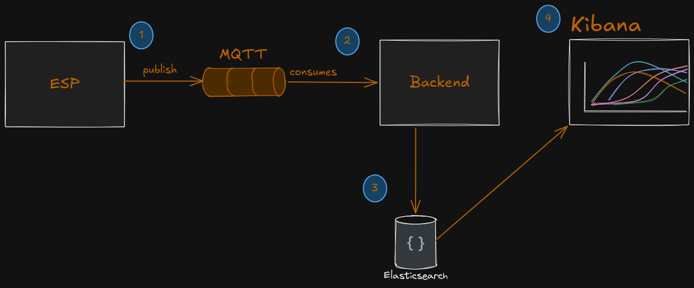
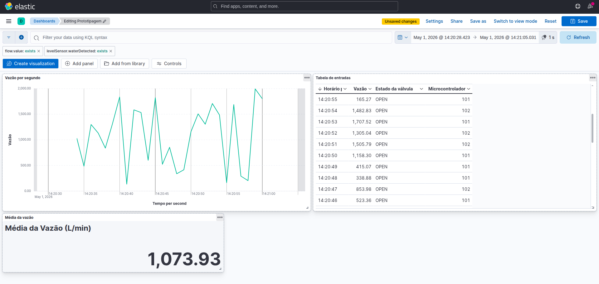

# Smart Hydrometer IoT

Sistema inteligente de monitoramento de fluxo de água capaz de identificar o tipo de fluido (água ou ar) em tempo real, atuando automaticamente para evitar medições incorretas e desperdícios.

---

## Visão Geral

Este projeto propõe o desenvolvimento de um hidrômetro inteligente baseado em IoT, utilizando um microcontrolador ESP32 para processamento local e comunicação com um backend em Python.

O sistema é capaz de:

- Monitorar o fluxo de água em tempo real  
- Identificar a presença de ar na tubulação  
- Bloquear automaticamente o fluxo indevido  
- Enviar dados para análise e visualização  
- Detectar padrões de consumo e possíveis anomalias  

## Como rodar o projeto
Requisitos:
- python
- docker
- docker compose

Rode na raíz do projeto
```bash
 docker compose up -d
```
Isso inicializará os containers.
- O mosquitto fica disponível na porta 1883, este sendo acessado pelo IP da sua máquina na rede para publicação de mensagens
- O Kibana fica disponível na porta 5601, este sendo acessado via localhost no navegador

Para usar o script com o teste de carga, basta entrar na pasta dev/scripts e rodar esse comando para baixar as dependências:
```bash
pip install -r requirements.txt
```
O script sensor_simulator.py se conecta com a fila do mosquitto e envia mensagens com valores aleatórios dentro do que o backend espera
para rodar basta usar:
```bash
python sensor_simulator.py --intervalo <intervalo_entre_cada_mensagem> --total <total_de_mensagens>
```

## Arquitetura


1. O microcontrolador coleta dados dos sensores de nível e vazão e publica mensagens com os dados numa fila
2. O backend consome as mensagens na fila, fazendo o parsing do conteúdo e aplicando regras de negócio válidas
3. O backend envia os dados tratados para o ElasticSearch, um banco de dados NoSql orientado a documentos
4. O Kibana realiza a leitura os dados inseridos no Elastic e gera visualizações em dashboards, para monitoramento do que é captado pelos sensores.

###### Tecnologias utilizadas
- Docker para isolar as aplicações e facilitar a reprodutibilidade da build gerada
- Mosquitto como broker MQTT para a fila
- Spring para o backend
- ElasticSearch como banco de dados
- Kibana para visualização dos dados

## Comunicação

O processo de comunicação é assíncrono via mensageria, para que o backend leia, interprete e armazene um dado de medição,
deverá ser enviado na fila do mosquitto com o seguinte formato:
```json
{ "deviceId": long,
  "flow": double, 
  "hasWater": boolean, 
  "isValveOpen": boolean, 
  "timestampInSeconds": long
}
```
Em que:
- **deviceId:** id do microcontrolador que envia os dados
- **flow:** valor medido da vazão
- **hasWater:** indicador se o sensor de nível detectou água na tubulação ou não
- **isValveOpen:** indicador se a válvula solenóide está aberta ou fechada
- **timestampInSeconds:** timestamp em segundos do momento da medição

A fila que sendo escutada pelo Spring é a `topic.flow`

## Visualização

O kibana fica disponível em `localhost:5601` e há um arquivo na pasta kibana, que está na raíz do projeto, com a
configuração de um dashboard, basta importá-lo no kibana e o seguinte dashboard poderá ser acessado:



Obs: A aplicação na totalidade pode ser um pouco pesada em memória, apesar da limitação de consumo do elastic que foi
estabelecido, cuidado ao executar o teste de carga, monitore os recursos da sua máquina.
